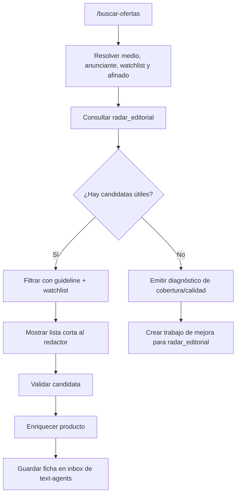

# Radar editorial como fuente principal de ofertas

## Problem Frame

El flujo actual de `/buscar-ofertas` intenta descubrir ofertas en vivo desde agregadores como Chollometro y canales de Telegram. En la práctica, eso fuerza al agente a revisar demasiadas candidatas una a una, resolver enlaces, filtrar ruido y gastar tiempo en navegación que debería estar preprocesada.

Ya existe un servicio Django en producción, `radar_editorial`, que ingesta ofertas de varias fuentes, guarda una cola editorial y centraliza parte del trabajo de scraping, precios, descuentos, tiendas y scoring. La decisión de producto cambia: este repositorio no debe competir con ese radar ni duplicar su ingesta. Debe usarlo como catálogo principal y concentrarse en la experiencia conversacional del redactor, el filtro por guideline/watchlist y el handoff a `claude-code-text-agents`.

Si una búsqueda no encuentra ofertas útiles, eso no significa que `/buscar-ofertas` deba salir a scrapear por su cuenta. Significa que el radar no está capturando suficientes datos fiables para esa intención, y el trabajo correcto es mejorar `radar_editorial`: fuentes semilla, extracción de URLs, precios, descuentos, dedupe, categorías y cobertura.

## Requirements

**Fuente de verdad**
- R1. `/buscar-ofertas` debe consultar primero y por defecto el catálogo de ofertas de `radar_editorial`.
- R2. Las fuentes directas locales de este repo no deben actuar como fallback automático cuando el radar devuelve cero resultados.
- R3. El radar debe considerarse la capa responsable de descubrir, actualizar y normalizar ofertas desde Chollometro, MiChollo, Telegram y cualquier otro site semilla.
- R4. Este repo debe conservar la responsabilidad de interpretar medio, anunciante, watchlist, afinado conversacional y guideline editorial.

**Consulta editorial**
- R5. La consulta al radar debe aceptar filtros equivalentes a los que necesita el redactor: anunciante/tienda, texto libre, watchlist, rango de precio, score mínimo, descuento mínimo, categorías y frescura.
- R6. Los resultados del radar deben incluir datos suficientes para que `/buscar-ofertas` pueda filtrar sin abrir navegador: título, tienda, fuente, precio actual, precio anterior, descuento, score, URL de origen, URL de producto si existe, imagen, categoría y fecha de última detección.
- R7. `/buscar-ofertas` debe aplicar después su filtro editorial propio usando `GUIDELINE-{medio}.md`, watchlists locales y afinado de sesión.
- R8. El redactor debe ver una lista corta y explicada de candidatas, no un volcado bruto del radar.

**Calidad y degradación**
- R9. Si el radar devuelve resultados incompletos, `/buscar-ofertas` debe marcar claramente qué falta: URL de producto, precio anterior, descuento, categoría, imagen o frescura.
- R10. Si no hay suficientes resultados útiles, la salida debe convertirse en diagnóstico accionable para mejorar `radar_editorial`, no en scraping local inmediato.
- R11. El diagnóstico debe indicar qué intención falló, qué filtros se usaron y qué dimensión parece fallar: cobertura de fuente, normalización de tienda, extracción de precio, dedupe, categoría o endpoint/API.
- R12. El flujo debe permitir seguir con resultados parciales solo si el redactor lo decide, dejando claro que la base del radar necesita mejora.

**Mejora del radar**
- R13. `radar_editorial` debe tener prioridad de mejora sobre nuevos scrapers locales cuando falten ofertas.
- R14. Las fuentes semilla del radar deben auditarse hasta que capturen correctamente URLs finales, precios actuales, precios anteriores, descuentos y tienda canónica.
- R15. Los sites semilla deben tratarse como inventario gestionado: fuente activa, estado, última ingesta correcta, fallos recientes y calidad de datos.
- R16. Las mejoras de extracción descubiertas desde `/buscar-ofertas` deben documentarse como feedback para el radar, con ejemplos de búsquedas fallidas o datos incompletos.

**Handoff editorial**
- R17. Una oferta seleccionada desde el radar debe poder acabar en la inbox de `claude-code-text-agents` igual que las candidatas actuales.
- R18. El enriquecimiento de producto debe ocurrir solo después de que el redactor valide una candidata, no durante la búsqueda inicial.
- R19. El historial local debe registrar que la fuente de descubrimiento fue `radar_editorial` y conservar el ID o URL de origen de la oferta.

## Success Criteria

- `/buscar-ofertas` devuelve candidatas en segundos cuando el radar ya tiene ofertas relevantes.
- La navegación con Playwright deja de formar parte del descubrimiento normal y queda limitada al enriquecimiento de candidatas validadas.
- Cuando no hay resultados, el sistema produce un diagnóstico útil para mejorar el radar en vez de consumir tiempo revisando agregadores en directo.
- El radar se convierte en la despensa fiable de ofertas: cada nueva fuente o fix de extracción mejora a todos los medios y futuras búsquedas.
- El redactor mantiene la misma experiencia final: elegir medio, anunciante/watchlist, revisar candidatas, validar y mandar a la inbox.

## Scope Boundaries

- No se debe crear una segunda base de datos de ofertas en este repo.
- No se debe portar el sistema Django a este proyecto.
- No se debe hacer scraping directo de Chollometro/Telegram como respuesta automática a cero resultados.
- No se debe convertir `/buscar-ofertas` en un panel ni duplicar la cola editorial de `radar_editorial`.
- No se exige que el radar genere artículos; su papel aquí es descubrimiento y calidad de catálogo.
- No se elimina todavía el código/prompt de scrapers locales, pero pasan a ser fallback manual o herramienta de diagnóstico, no flujo principal.

## Key Decisions

- **Radar como fuente principal**: reduce duplicación, aprovecha un servicio ya operativo y convierte cada mejora de ingesta en valor acumulado.
- **Sin fallback automático a fuentes directas**: evita perpetuar el problema. Si el radar no encuentra, hay que mejorar la despensa, no mandar al redactor a cocinar desde cero cada vez.
- **Separación descubrir/seleccionar**: el radar descubre y normaliza; este repo selecciona con criterio editorial y conversa con el redactor.
- **Diagnóstico como salida válida**: una búsqueda fallida debe producir aprendizaje estructurado para arreglar fuentes semilla, no solo “0 resultados”.

## High-Level Flow

## Plan de Enfoque

**Fase 1: contrato mínimo entre proyectos**
- Definir qué datos necesita `/buscar-ofertas` del radar para filtrar sin navegador.
- Exponer o reutilizar una salida autenticada del radar con ofertas pendientes y filtros suficientes.
- Documentar cómo se configura la URL del radar y sus credenciales en este repo.

**Fase 2: adaptar `/buscar-ofertas`**
- Cambiar la fuente por defecto a `radar_editorial`.
- Aplicar guideline, watchlist y afinado sobre los resultados del radar.
- Mantener el handoff actual a la inbox para las ofertas validadas.

**Fase 3: diagnóstico en vez de fallback**
- Cuando falten resultados, generar un informe breve con filtros usados y posibles causas.
- Registrar el caso como feedback accionable para el radar.
- Desactivar la expectativa de que el agente haga scraping local para compensar una base incompleta.

**Fase 4: endurecer radar_editorial**
- Auditar fuentes semilla existentes.
- Priorizar fixes por impacto editorial: URLs finales, precio anterior, descuento real, tienda canónica y frescura.
- Añadir pruebas o comprobaciones recurrentes para que una fuente rota no parezca una búsqueda sin resultados.

## Dependencies / Assumptions

- `radar_editorial` está desplegado y accesible en Railway.
- La cola de ofertas del radar ya contiene parte del inventario útil, aunque hoy las vistas principales requieren login.
- Puede añadirse o reutilizarse una vía de consulta autenticada para agentes sin abrir la interfaz web.
- `claude-code-text-agents` sigue siendo el destino de las fichas validadas.

## Outstanding Questions

### Resolve Before Planning

_Ninguna. La dirección de producto queda cerrada: radar primero, mejoras en radar si no hay resultados._

### Deferred to Planning

- [Afecta R5, R6][Técnico] Definir si se consume un endpoint JSON nuevo, un CSV autenticado existente o una integración interna más directa.
- [Afecta R10, R11][Técnico] Decidir dónde se guardan los diagnósticos de búsquedas fallidas para alimentar el backlog de `radar_editorial`.
- [Afecta R13-R16][Needs research] Auditar el estado real de las fuentes semilla actuales del radar y ordenar fixes por cobertura y calidad.
- [Afecta R17-R19][Técnico] Mapear los campos del radar al formato exacto de ficha que espera la inbox de `claude-code-text-agents`.

## Next Steps

-> `/ce:plan` para convertir este brief en un plan de implementación por fases.
