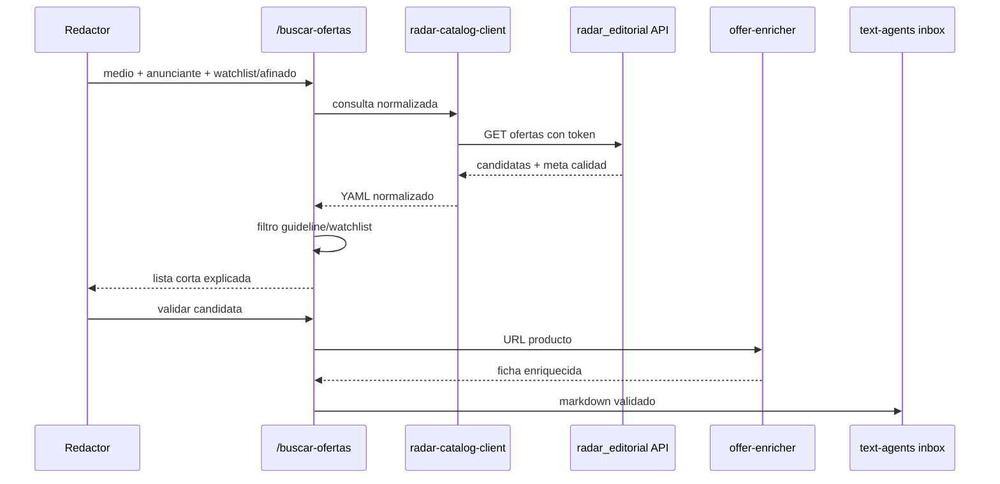

# Radar editorial como fuente principal de buscar-ofertas

## Overview

`/buscar-ofertas` debe dejar de descubrir ofertas en vivo como flujo principal y pasar a consultar el catálogo ya ingestado por `radar_editorial`. El radar queda como fuente de verdad para descubrir, normalizar y auditar ofertas; este repo mantiene la capa conversacional: medio, anunciante, watchlist, guideline, validación del redactor, enriquecimiento final y handoff a la inbox de `claude-code-text-agents`.

El trabajo se reparte en dos repos:

- **Target repo: `Proyecto analizador de ofertas/radar_editorial`**: exponer una consulta JSON autenticada, cubrirla con tests y endurecer la calidad de fuentes semilla.
- **Target repo: `claude-code-localizador-ofertas`**: añadir el cliente del radar, cambiar el prompt de `/buscar-ofertas`, documentar el nuevo flujo y registrar diagnósticos cuando el radar no cubra una intención.

## Problem Frame

El flujo actual paga el coste de scraping en el momento menos conveniente: cuando el redactor está esperando candidatas. Eso convierte cada búsqueda en una exploración lenta y frágil. El brief de origen invierte la arquitectura: si el radar no encuentra ofertas, no se compensa con scraping local automático; se mejora el radar para que la próxima búsqueda sea mejor.

## Requirements Trace

- R1-R4. El radar es la fuente principal; este repo conserva filtrado editorial, watchlists y conversación.
- R5-R8. La consulta debe entregar campos suficientes para filtrar sin navegador y devolver una lista corta explicada.
- R9-R12. Resultados incompletos o vacíos producen diagnóstico accionable, no fallback automático a scrapers locales.
- R13-R16. La mejora estructural se concentra en `radar_editorial` y sus fuentes semilla.
- R17-R19. Las ofertas validadas siguen llegando a la inbox del proyecto de redacción, con historial que preserve el origen `radar_editorial`.

## Scope Boundaries

- No se porta Django a este repo.
- No se crea una segunda base de datos local de ofertas.
- No se hace scraping directo de Chollometro/Telegram como fallback automático.
- No se cambia la generación de artículos de `claude-code-text-agents`.
- No se elimina en esta fase todo el prompt de scrapers locales; se degrada a herramienta manual/diagnóstica o reserva explícita.

### Deferred to Separate Tasks

- Automatizar scheduling de ingesta en Railway: queda para un plan operativo específico si hoy no está resuelto.
- Reescribir el panel editorial del radar: fuera de este cambio.
- Aprendizaje automático con rechazos/validaciones: se conserva información, pero no se implementa ranking aprendido.

## Context & Research

### Relevant Code and Patterns

**En `radar_editorial`:**
- `apps/catalog/models.py`: `Offer` ya contiene `title`, `source`, `external_id`, `url`, `product_url`, `store`, `image_url`, `original_price`, `price`, `status`, `last_seen_at`, `category`, `score`, `enriched_data` y `discount_pct`.
- `apps/editorial/views.py`: `queue_view` ya filtra por tienda, categoría, marca y orden; `queue_export_csv_view` exporta ofertas pendientes, pero requiere login y no contiene todos los campos necesarios.
- `apps/editorial/urls.py`: rutas editoriales existentes; conviene añadir una ruta API separada en vez de sobrecargar el HTML o el CSV.
- `apps/ingestion/services/adapters.py`: adaptadores existentes para Chollometro, MiChollo, NoTengoSuelto y Telegram. Chollometro ya intenta API JSON interna por `merchant-id`.
- `apps/ingestion/tests/test_ingestion_bugs.py` y `apps/editorial/tests/test_queue_view.py`: tests ya cubren `product_url`, tienda soportada, filtros y visualización de cola.
- `config/settings/base.py`: usa `python-decouple`; es el lugar natural para leer un token de API desde entorno sin introducir nueva dependencia.

**En `claude-code-localizador-ofertas`:**
- `.claude/skills/buscar-ofertas/SKILL.md`: hoy orquesta selección de fuentes y scrapers directos.
- `.claude/agents/offer-enricher.md`: sigue siendo válido para enriquecer solo después de validar candidata.
- `fuentes.md`, `README.md`, `CLAUDE.md`, `docs/instalacion.txt`: describen el flujo antiguo y deben cambiar para que el radar sea fuente principal.
- `.claude/settings.json`: hoy permite dominios de agregadores, pero no Railway. Hay que permitir la URL del radar solo para el cliente/subagente que la consuma.

### Institutional Learnings

- El plan anterior `docs/plans/2026-05-18-001-feat-localizador-ofertas-plan.md` rechazaba DB/panel por simplicidad local. El brief nuevo cambia esa decisión porque ya existe un radar operativo y la duplicación local está generando coste real.
- `knowledge/notas-degradacion.md` documenta fragilidad de Chollometro; es una señal a favor de centralizar fixes en el radar.

### External References

- Django 5.1 `HttpRequest.headers` permite leer cabeceras de forma case-insensitive; encaja con un token tipo `Authorization: Bearer ...`.
- Django 5.1 `JsonResponse` es suficiente para un endpoint JSON simple sin añadir Django REST Framework.
- Django 5.1 test client permite cubrir vistas con cabeceras HTTP y respuestas JSON.

## Key Technical Decisions

- **Endpoint JSON nuevo en el radar, no scraping de HTML ni CSV**: el CSV actual está autenticado por sesión y es pobre en campos. Un endpoint explícito evita depender de marcado HTML o cookies de navegador.
- **Autenticación por token compartido en cabecera**: es suficiente para un consumidor agente-a-servicio, evita meter DRF/JWT y encaja con el stack actual basado en Django puro.
- **Serializador local pequeño, no DRF**: el proyecto no usa DRF; añadirlo solo para una lista de ofertas aumentaría superficie y configuración.
- **Cliente como subagente/prompt dedicado en este repo**: mantiene la separación actual de capas. El orquestador sigue leyendo guidelines/watchlists; el nuevo cliente solo consulta catálogo y devuelve candidatas normalizadas.
- **Diagnóstico persistido en historial local**: cuando no haya resultados útiles, el usuario recibe una explicación y queda un artefacto para convertir en trabajo de mejora del radar.

## Open Questions

### Resolved During Planning

- **¿JSON nuevo o CSV existente?** JSON nuevo. El CSV requiere login de sesión, no incluye todos los campos y mezcla presentación con contrato de integración.
- **¿Fallback local automático?** No. El brief lo prohíbe explícitamente; los scrapers locales quedan como herramienta manual o reserva, no como ruta normal.
- **¿Dónde se resuelve la calidad de fuentes?** En `radar_editorial`, con tests y auditoría de adaptadores.

### Deferred to Implementation

- **Nombre exacto del endpoint y módulo API**: el plan propone una ruta estable, pero el implementador puede ajustar el módulo si el repo tiene una convención mejor.
- **Formato exacto del diagnóstico**: debe incluir intención, filtros y causa probable; el detalle final puede ajustarse al historial existente.
- **Token en Railway**: el nombre de variable se planifica, pero el valor real se configura fuera del repo.

## High-Level Technical Design

> This illustrates the intended approach and is directional guidance for review, not implementation specification. The implementing agent should treat it as context, not code to reproduce.

## Implementation Units

- [ ] **Unit 1: Exponer API de consulta en radar_editorial**

**Goal:** Añadir una vía JSON autenticada para que agentes consulten ofertas pendientes del radar con filtros editoriales básicos.

**Requirements:** R1, R3, R5, R6

**Dependencies:** Ninguna.

**Files:**
- Target repo `Proyecto analizador de ofertas/radar_editorial`
- Create: `apps/editorial/api.py`
- Modify: `apps/editorial/urls.py`
- Modify: `config/settings/base.py`
- Modify: `.env.example`
- Test: `apps/editorial/tests/test_offers_api.py`

**Approach:**
- Añadir una vista GET JSON separada del HTML de cola.
- Leer un token de entorno, por ejemplo `RADAR_AGENT_API_TOKEN`; si no está configurado, el endpoint debe rechazar con error claro en producción y no filtrar silenciosamente.
- Autenticar con una cabecera estable (`Authorization: Bearer <token>` o cabecera dedicada equivalente).
- Soportar filtros de consulta: tienda/anunciante, texto, categoría, precio mínimo/máximo, descuento mínimo, score mínimo, frescura, límite y orden.
- Responder con `items` y `meta`. `items` debe incluir los campos de R6; `meta` debe incluir conteos útiles para diagnóstico: total antes/después de filtros, ofertas incompletas por campo y filtros aplicados.
- Reutilizar normalización existente de tienda/categoría cuando sea razonable, evitando copiar lógica divergente desde `queue_view`.

**Execution note:** Empezar con tests de contrato del endpoint antes de modificar la vista; es una superficie consumida por otro repo.

**Patterns to follow:**
- `apps/editorial/views.py` para filtros de cola y normalización.
- `apps/editorial/tests/test_queue_view.py` para tests Django con `client.force_login`, adaptando a autenticación por cabecera.
- `apps/catalog/models.py` para campos disponibles y cálculo de `discount_pct`.

**Test scenarios:**
- Happy path: GET autenticado con `store=amazon&limit=10` devuelve solo ofertas Amazon soportadas, ordenadas por score o frescura según el parámetro.
- Happy path: una oferta con `product_url`, `image_url`, `category`, `score` y precios devuelve todos los campos esperados en JSON.
- Edge case: `store=aliexpressplaza` se normaliza a `aliexpress.com`.
- Edge case: `q=sony anc` filtra por texto en título de forma case-insensitive.
- Error path: sin token devuelve respuesta JSON de no autorizado y no filtra hacia login HTML.
- Error path: token incorrecto devuelve no autorizado.
- Integration: `reverse()` de la nueva ruta resuelve y no rompe rutas HTML existentes de cola.

**Verification:**
- El endpoint puede consultarse sin sesión de navegador, con token, y devuelve JSON suficiente para filtrar sin abrir Playwright.

- [ ] **Unit 2: Añadir métricas de calidad y diagnóstico al endpoint**

**Goal:** Hacer que una respuesta pobre del radar sea útil para mejorar el radar, no solo para decir “0 resultados”.

**Requirements:** R9, R10, R11, R12

**Dependencies:** Unit 1.

**Files:**
- Target repo `Proyecto analizador de ofertas/radar_editorial`
- Modify: `apps/editorial/api.py`
- Test: `apps/editorial/tests/test_offers_api.py`

**Approach:**
- Incluir en `meta` un resumen de calidad: cuántas ofertas carecen de `product_url`, `original_price` útil, descuento positivo, categoría, imagen o frescura reciente.
- Cuando una consulta no devuelva `items`, incluir `diagnostics` con causa probable basada en conteos: sin cobertura de tienda, filtros demasiado estrictos, falta de categoría, precios incompletos, ofertas antiguas o endpoint sin inventario.
- Mantener el diagnóstico como datos estructurados, no texto largo. El texto final al redactor lo genera `/buscar-ofertas`.

**Patterns to follow:**
- `Offer.discount_pct` en `apps/catalog/models.py`.
- Normalizaciones de tienda/categoría de `apps/editorial/views.py`.

**Test scenarios:**
- Happy path: con ofertas incompletas, `meta.quality` cuenta correctamente faltantes por campo.
- Edge case: filtros que dejan cero resultados pero existen ofertas de otra tienda producen diagnóstico de cobertura/filtro, no error genérico.
- Edge case: ofertas con `original_price == price` se cuentan como descuento no útil.
- Error path: parámetros numéricos inválidos se ignoran o devuelven error JSON consistente, según la decisión de implementación, pero nunca 500.

**Verification:**
- Una búsqueda vacía puede explicar por qué falló con datos que un implementador pueda convertir en mejoras del radar.

- [ ] **Unit 3: Auditar y endurecer fuentes semilla del radar**

**Goal:** Asegurar que Chollometro, MiChollo y canales existentes alimentan el catálogo con URLs, precios, descuentos y tienda canónica fiables.

**Requirements:** R13, R14, R15, R16

**Dependencies:** Puede avanzar en paralelo con Unit 1; Unit 2 se beneficia de sus hallazgos.

**Files:**
- Target repo `Proyecto analizador de ofertas/radar_editorial`
- Modify: `apps/ingestion/services/adapters.py`
- Modify: `apps/ingestion/services/filters.py` if needed
- Create: `apps/ingestion/management/commands/audit_sources.py`
- Test: `apps/ingestion/tests/test_source_quality_contract.py`
- Test: `apps/ingestion/tests/test_ingestion_bugs.py`
- Modify: `docs/OPERATIONS.md`

**Approach:**
- Definir un contrato mínimo de row por fuente: `external_id`, `title`, `url`, `store`, `price`, `original_price`, `image_url`, `product_url`.
- Añadir tests de contrato para cada adaptador activo: Chollometro, MiChollo, Chollazos, HispaChollos y NoTengoSuelto si sigue activo.
- Añadir un comando de auditoría que ejecute fuentes y reporte conteos por fuente: filas totales, filas válidas, sin `product_url`, sin precio anterior útil, tienda no soportada, descuento no calculable.
- Mantener el comando como herramienta operativa; no debe reemplazar la ingesta.
- Documentar cómo interpretar la auditoría y qué fuente arreglar primero.

**Execution note:** Caracterizar primero lo que los adaptadores devuelven hoy antes de cambiar parsers.

**Patterns to follow:**
- `apps/ingestion/tests/test_ingestion_bugs.py` para mocks de adaptadores y regresiones concretas.
- `apps/ingestion/management/commands/run_ingestion.py` para estilo de management command.

**Test scenarios:**
- Happy path: cada adaptador activo que recibe payload mock con todos los campos devuelve row normalizada.
- Edge case: una fuente con link al propio agregador no rellena `product_url` como si fuera URL final.
- Edge case: tiendas AliExpress alias se normalizan a `aliexpress.com`.
- Error path: fuente que falla no tumba la auditoría completa; queda reportada como fallida.
- Integration: `run_ingestion` conserva `product_url`, `store`, `image_url`, precios y `last_seen_at` tras guardar.

**Verification:**
- El radar puede explicar objetivamente qué fuentes están alimentando bien la base y cuáles requieren fix.

- [ ] **Unit 4: Crear cliente/subagente de radar en el localizador**

**Goal:** Añadir una capa dedicada que consulte el endpoint del radar y devuelva candidatas normalizadas a `/buscar-ofertas`.

**Requirements:** R1, R4, R5, R6, R9

**Dependencies:** Unit 1.

**Files:**
- Target repo `claude-code-localizador-ofertas`
- Create: `.claude/agents/radar-catalog-client.md`
- Modify: `.claude/settings.json`
- Modify: `fuentes.md`
- Create: `docs/integracion-radar-editorial.txt`
- Test: `docs/qa/radar-editorial-client-uat.md`

**Approach:**
- Crear un subagente de solo consulta: recibe anunciante, texto/watchlist resumida, filtros y límite; llama al radar; devuelve YAML normalizado.
- Configurar la URL base del radar y el token como valores que el operador pueda ajustar sin editar prompts sensibles. Si el ecosistema de Claude no permite variables de entorno limpias, documentar el mecanismo elegido.
- Añadir permiso de WebFetch solo para el dominio Railway del radar y retirar del flujo normal la necesidad de WebFetch/Playwright sobre Chollometro/Telegram.
- Actualizar `fuentes.md` para marcar `radar_editorial` como fuente principal y fuentes directas como reserva manual/diagnóstico.

**Patterns to follow:**
- `.claude/agents/telegram-scraper.md` para forma de subagente que devuelve YAML.
- `.claude/agents/offer-enricher.md` para límites de responsabilidad de agentes.
- `fuentes.md` para registrar fuentes y estado.

**Test scenarios:**
- Happy path: dada una respuesta JSON del radar con dos ofertas, el subagente devuelve candidatas YAML con campos esperados.
- Edge case: oferta sin `product_url` queda marcada como incompleta pero no se inventa URL.
- Error path: 401/403 del radar se comunica como error de configuración, no como “no hay ofertas”.
- Error path: respuesta vacía con `diagnostics` se transmite al orquestador sin activar scrapers locales.
- Integration: una candidata normalizada incluye `fuente: radar_editorial` y `radar_offer_id` o equivalente.

**Verification:**
- El orquestador puede recibir candidatas del radar en el mismo formato conceptual que antes recibía de scrapers, sin abrir navegador.

- [ ] **Unit 5: Reorientar `/buscar-ofertas` a radar primero y sin fallback automático**

**Goal:** Cambiar el flujo de la skill para consultar el radar, filtrar editorialmente y producir diagnóstico si no hay resultados.

**Requirements:** R1, R2, R4, R7, R8, R10, R11, R12, R17, R18, R19

**Dependencies:** Unit 4; Unit 1 para verificación real contra el radar.

**Files:**
- Target repo `claude-code-localizador-ofertas`
- Modify: `.claude/skills/buscar-ofertas/SKILL.md`
- Modify: `.claude/agents/aggregator-scraper.md`
- Modify: `.claude/agents/telegram-scraper.md`
- Modify: `historial/` behavior documentation in `CLAUDE.md`
- Test: `docs/qa/buscar-ofertas-radar-uat.md`

**Approach:**
- Sustituir el paso de selección de fuentes por “radar por defecto”. Si se conserva selección manual, debe quedar explícita como diagnóstico avanzado, no ruta recomendada.
- Cambiar el Paso 2 para invocar `radar-catalog-client` con anunciante, watchlist/afinado y límite.
- Mantener el filtrado editorial inline del Paso 3, pero aplicado a candidatas del radar.
- Cuando el radar devuelva cero útiles, generar un diagnóstico para el redactor y guardar un archivo de historial/diagnóstico. No invocar `aggregator-scraper` ni `telegram-scraper` automáticamente.
- Mantener el Paso 5 de enriquecimiento con `offer-enricher` solo tras validación humana.
- Registrar `radar_offer_id`, `url_origen`, `product_url` y campos incompletos en historial.

**Patterns to follow:**
- `.claude/skills/buscar-ofertas/SKILL.md` para el tono y estructura interactiva actual.
- `historial/YYYY-MM-DD-sesion-{n}.md` como patrón de persistencia de sesión.

**Test scenarios:**
- Happy path: radar devuelve candidatas suficientes; la skill filtra por guideline/watchlist y presenta máximo 12 candidatas explicadas.
- Happy path: redactor valida una candidata con `product_url`; se invoca `offer-enricher` y se escribe ficha en inbox.
- Edge case: radar devuelve resultados parciales con campos faltantes; la skill los muestra con aviso de calidad.
- Edge case: radar devuelve cero resultados; la skill produce diagnóstico y no llama a scrapers locales.
- Error path: radar inaccesible o token inválido; la skill devuelve error de integración/configuración y no lo confunde con falta de ofertas.
- Integration: historial de sesión registra `fuente_descubrimiento: radar_editorial`.

**Verification:**
- En una sesión real, `/buscar-ofertas` deja de navegar por Chollometro para descubrir candidatas.

- [ ] **Unit 6: Actualizar documentación y operación**

**Goal:** Alinear instrucciones, instalación y changelog con el nuevo flujo basado en radar.

**Requirements:** R1-R19

**Dependencies:** Units 1-5, aunque puede prepararse en paralelo y ajustar al final.

**Files:**
- Target repo `claude-code-localizador-ofertas`
- Modify: `README.md`
- Modify: `CLAUDE.md`
- Modify: `docs/instalacion.txt`
- Modify: `knowledge/notas-degradacion.md`
- Modify: `changelog/changelog-19-05-2026.txt`
- Create: `docs/qa/radar-editorial-end-to-end-uat.md`
- Target repo `Proyecto analizador de ofertas/radar_editorial`
- Modify: `docs/OPERATIONS.md`
- Modify: `.env.example`

**Approach:**
- Documentar que `radar_editorial` es dependencia operativa, no fuente opcional.
- Explicar cómo configurar URL/token del radar para el localizador.
- Reescribir “Qué NO hace” para reflejar que el repo ya no mantiene la ingesta principal.
- Añadir checklist UAT: health del radar, endpoint autenticado, consulta con resultados, consulta vacía con diagnóstico, validación e inbox.
- En el radar, documentar cómo ejecutar ingesta y auditoría de fuentes semilla.

**Patterns to follow:**
- `docs/instalacion.txt` para estilo de guía operacional.
- `changelog/changelog-19-05-2026.txt` para resumen diario conciso.

**Test scenarios:**
- Test expectation: none for prose docs; verification es revisión de consistencia contra los requisitos y UAT manual.

**Verification:**
- Un operador puede configurar ambos repos y entender que arreglar cero resultados implica mejorar el radar.

## System-Wide Impact

- **Interaction graph:** `/buscar-ofertas` pasa de orquestar múltiples scrapers a consultar un cliente del radar y solo usar `offer-enricher` tras validación.
- **Error propagation:** errores de radar deben distinguir configuración/autenticación, servicio caído, cero resultados y resultados incompletos.
- **State lifecycle risks:** una oferta puede existir en radar y luego cambiar/expirar; el localizador debe conservar el ID/origen y enriquecer solo al validar.
- **API surface parity:** el endpoint JSON debe mantenerse compatible con la cola HTML, pero no tiene por qué exponer acciones de selección/rechazo del panel.
- **Integration coverage:** el contrato radar -> cliente -> `/buscar-ofertas` necesita UAT con datos reales, porque los prompts no tienen test unitario tradicional.
- **Unchanged invariants:** el handoff final a `../claude-code-text-agents/inbox/` y el enriquecimiento post-validación se conservan.

## Phased Delivery

### Phase 1: Contrato del radar
- Implementar Units 1 y 2.
- Resultado: endpoint seguro y diagnosticable, listo para consumo.

### Phase 2: Cliente localizador
- Implementar Units 4 y 5.
- Resultado: `/buscar-ofertas` usa radar y no activa fallback local.

### Phase 3: Calidad de catálogo
- Implementar Unit 3 y cerrar documentación de Unit 6.
- Resultado: fuentes semilla auditables y flujo operativo claro para mejorar cobertura.

## Risks & Dependencies

| Risk | Mitigation |
|------|------------|
| Token mal configurado en Railway o localizador | Endpoint devuelve error JSON claro; docs incluyen checklist de configuración. |
| El radar tiene pocas ofertas útiles al principio | El flujo produce diagnóstico y Unit 3 prioriza fuentes semilla por calidad. |
| El endpoint duplica lógica de `queue_view` | Extraer o reutilizar helpers de normalización cuando se implemente. |
| Prompts locales siguen mencionando scraping directo como normal | Unit 5 y Unit 6 actualizan skill, fuentes y docs para cambiar la expectativa. |
| Datos del radar tienen `product_url` incompleto | Resultados lo marcan como incompleto y se convierte en trabajo de mejora del radar. |
| Cambiar dos repos complica despliegue | Fasear: primero radar API compatible, luego cliente local. |

## Documentation / Operational Notes

- Configurar `RADAR_AGENT_API_TOKEN` en Railway y el mecanismo equivalente en el entorno local del agente.
- Añadir la URL base del radar a la documentación del localizador.
- Mantener el changelog diario en `changelog/changelog-19-05-2026.txt`.
- Registrar diagnósticos de búsquedas fallidas como insumos para `radar_editorial`.

## Sources & References

- **Origin document:** [docs/brainstorms/2026-05-19-radar-editorial-fuente-principal-requirements.md](../brainstorms/2026-05-19-radar-editorial-fuente-principal-requirements.md)
- Existing local plan: [docs/plans/2026-05-18-001-feat-localizador-ofertas-plan.md](2026-05-18-001-feat-localizador-ofertas-plan.md)
- Localizador orchestrator: `.claude/skills/buscar-ofertas/SKILL.md`
- Localizador enricher: `.claude/agents/offer-enricher.md`
- Radar model: `apps/catalog/models.py` in target repo `Proyecto analizador de ofertas/radar_editorial`
- Radar ingestion adapters: `apps/ingestion/services/adapters.py` in target repo `Proyecto analizador de ofertas/radar_editorial`
- Radar queue patterns: `apps/editorial/views.py` and `apps/editorial/tests/test_queue_view.py` in target repo `Proyecto analizador de ofertas/radar_editorial`
- Django request/response docs: https://docs.djangoproject.com/en/5.1/ref/request-response/
- Django testing tools docs: https://docs.djangoproject.com/en/5.1/topics/testing/tools/
